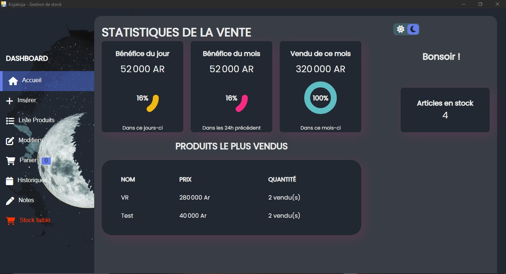
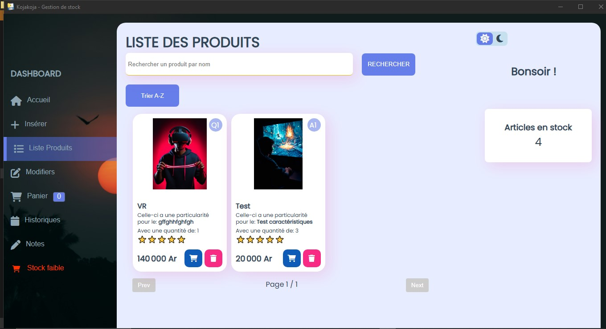
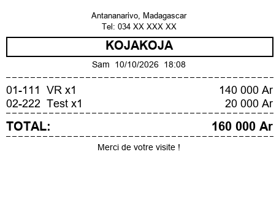

# Kojakoja – Gestion de stock

Application de bureau de gestion de stock pour Windows, développée en **Python** avec **PyWebView**. L'interface est en HTML, CSS et JavaScript, et les données sont stockées dans une base **SQLite** locale.

## Fonctionnalités

- Gestion du stock de produits
- Génération de reçus et de factures en **PDF** et en **image PNG**, au format ticket thermique (57 mm, 203 DPI)
- Dates et jours affichés en français
- Application empaquetée en `.exe` avec PyInstaller, utilisable sans installer Python

<!-- Ajoute ici tes autres fonctionnalités, une par ligne, par exemple : ajout et modification de produits, ventes, alertes de stock bas... -->

## Captures d'écran


*Tableau de bord de l'application.*


*Liste des produits et de leur quantité en stock.*


*Exemple de reçu généré (données fictives).*

## Technologies

- Python
- PyWebView
- SQLite
- HTML, CSS, JavaScript
- Pillow et ReportLab (génération des images et des PDF)
- PyInstaller (création de l'exécutable)

## Télécharger l'application (Windows)

1. Ouvre l'onglet **Releases** de ce dépôt.
2. Télécharge `gestion_stock.exe`.
3. Lance le fichier.

Windows peut afficher « Windows a protégé votre ordinateur », car l'application n'est pas signée. Clique sur **Informations complémentaires**, puis sur **Exécuter quand même**.

## Lancer le projet depuis le code

Prérequis : Python 3 et Windows 10 ou 11.

```
pip install -r requirements.txt
python main.py
```

## Structure du projet

```
├── main.py            # Point d'entrée : ouvre la fenêtre PyWebView
├── backend.py         # Logique Python (base de données, PDF, reçus)
├── main.spec          # Configuration PyInstaller
├── requirements.txt   # Bibliothèques Python nécessaires
└── web/               # Interface (HTML, CSS, JavaScript, polices, images)
```

## Auteur

Tokiniaina Fandresena Andrianjanahary
GitHub : [Fandresena-ai](https://github.com/Fandresena-ai)
